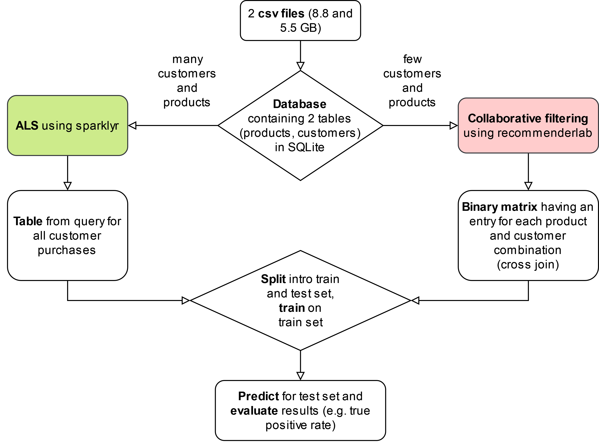

# A recommender system based on customer interaction with an e-commerce website

## Research question

E-commerce is a booming industry leading to tremendous numbers of purchased products each day. Although
the customers’ online behavior is often collected and stored, this data is often not leveraged due to its big size
or complexity. However, figuring out desired products for online shoppers may add economic value. We aim
to determine shoppers’ preferences to predict similar products. These products can then be recommended to
customers. With this goal in mind, we developed the following research question:

How well can we predict the purchasing behavior of an online shopping customer based on their previous shopping behavior as well as the purchasing behavior of other customers.

## How to execute our code

Our data is from [Kaggle](https://www.kaggle.com/datasets/mkechinov/ecommerce-behavior-data-from-multi-category-store) (please click on the link). In order to execute our code, you first have to download both csv files for October and November 2019. 

1. `creating_csv_files_for_db.R`: Once you saved the csv files, you can use this script for obtaining the "cleaned" csv files for the database.
2. `creatingDatabase_2csv_tables.sh`: Creates a database containing 2 tables, one table for all orders ('customer') and one for additional product information ('product').
3. `sql_queries_2.R`: Includes queries for analyzing the data in the database(s).
4. `binary_recommender2.R`: Our first attempt of predicting customer purchases using the recommenderlab package.
5. `sparklyr_v2.R`: Our most successful attempt of predicting customer purchases using sparklyr and ALS.

&nbsp;
  

