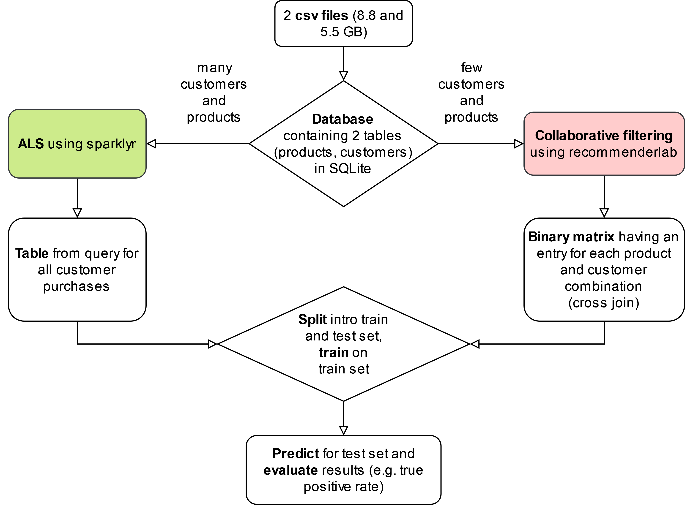

```{r setup, include=FALSE}
knitr::opts_chunk$set(echo = TRUE)
wd <- dirname(rstudioapi::getSourceEditorContext()$path) # Set the working directory wherever you save this R script
knitr::opts_knit$set(root.dir = wd)
getwd()
```

# Introduction

## Research Question

E-commerce is a booming industry leading to tremendous numbers of purchased products each day. Although the customers' online behavior is often collected and stored, this data is often not leveraged due to its big size or complexity. However, figuring out desired products for online shoppers may add economic value. We aim to determine shoppers' preferences to predict similar products. These products can then be recommended to customers.
With this goal in mind, we developed the following research question:

How well can we predict the purchasing behavior of an online shopping customer based on their previous shopping behavior as well as the purchasing behavior of other customers.


## Data Source(s)

We use 2 data sets from an e-commerce store that we found on [Kaggle](https://www.kaggle.com/datasets/mkechinov/ecommerce-behavior-data-from-multi-category-store) (please click on the link). The data consists of customer interactions with an e-commerce store from October to November 2019 (6 GB and 9 GB of data). Importantly, in order to run our code, you must first download both csv files for October and November 2019 and store them in the `data` folder. [Here](https://livehhsse-my.sharepoint.com/:f:/g/personal/41964_student_hhs_se/EnyJmIxrlchMv4OhCBHly94BPNQqICmy3vpzB1xk0qSnQg?e=0rMrq5) is a link to a data folder that contains all the csv files and the database that will be used later. If you have problems creating the database yourself, just download it.  

The data sets contain the following columns:

- Event time: complete data, it shows the date and time of the event. 
- Event type: complete data, it could be only one among these options (view, cart, remove, purchase). 
- Product id: complete data. 
- Category id: complete data. 
- Category code: some missing data points. 
- Brand: some missing data points. 
- Price: complete data. 
- User id: complete data. 
- User session: complete data.

## Summary of Methods and Results

We used `recommenderlab` and `sparklyr` to build our recommender engines. Initially, the flexibility and ease of use of recommenderlab was beneficial to map out the process of data pre-processing, training, and evaluating various recommender engines on a subsample of our data. Once we tried to ramp up the data volume, however, we realized that our recommenderlab implementation does not scale. Particularly, we identified two bottlenecks: 1) the user-item interaction matrix grew exponentially, and we ran out of RAM 2) prediction time increased non-linearly therefore we could no longer make predictions in real time. To overcome these bottlenecks, we implemented an ALS based recommender engine using sparklyr. The spark implementation allowed us to leverage the “split, apply and combine” methodology, saving us significant memory and processing time. With the spark implementation, we were able to scale our model to the entire data set and we achieved a true positive rate (TPR) of above 30% when making 15 recommendations per customer. Ultimately, when backtesting our model, we were able to generate upwards of $80K in additional revenue with a standard conversion rate assumption of 35% based on McK (2013). We believe that by using more data, we could further improve the predictive power of our solution. To accommodate larger data volumes, we could deploy our code on an AWS cluster in the cloud.


```{r}

```

# Data Collection and Data Storage


<!-- Describe how you approach the data collection procedure. In your research setting, what were the challenges regarding collecting the raw data. How did you solve these challenges? How do you store the raw data and why?  -->

We use two csv files containing the e-commerce behavior of online shoppers. One contains website interactions in November 2019 (around 9 GB) and the other from October 2019 (around 6 GB). So, in total, we have around 15 GB of data that we want to process.

There are two main issues we could address by using a database. Firstly, loading all the data would require a lot of memory. Secondly, loading parts of our data sets is often complicated and inefficient without a database. Once the database is built, it can be stored on a hard disk, solving the first bottleneck. An SQL query can then be used to retrieve only the data that is needed. This solves the second bottleneck, as queries provide an efficient way to load portions of the data. In addition, a database provides the ability to store the data in a logical structure. For example, we can have multiple tables and relationships within the tables.

When we created the database, we wanted to keep pre-processing to a minimum in order to preserve the most information. In an ideal world, we would have stored the data in three tables: one for customer information (e.g., customer ID, name, email), one for product information (e.g., product ID, name, category), and one for interaction information (e.g., event time, event type, product ID, customer ID). Due to simplicity and lack of customer data, we decided to use only two tables, one for the product information and one for the interaction with the e-commerce website. We decided to keep all information about the online interactions in the `Orders` table. Namely, whenever a customer performs a certain action, such as viewing a product, this information is stored in this table. A customer and product each have a unique ID. As a product ID should remain the same, we only need to save the product information once per product in the `Products` table. The `Products` table has the product ID as a primary key which is linked to the product ID in the `Orders` table, the foreign key. These two tables offer a comprehensive form of data storage and save some space on the hard disk as redundant product information is not stored anymore. But a product's price changes over time. By only keeping one price for each unique product, we lose some information. In this case, we decided to take the first price of each product. Alternatively, one could take the mean or median instead.

As for the coding, we first saved the information needed for the two database tables in csv files. To do this, we loaded only the columns we needed from the original csv files. "fread" is an efficient method for this purpose. When necessary, we grouped and summarized the data. After saving the csv files containing the data for the tables, we use a shell script to first create a new sqlite database and then import the data from the new csv files.


```{r, eval = FALSE}

# you first have to download the two csv files from https://www.kaggle.com/datasets/mkechinov/ecommerce-behavior-data-from-multi-category-store
# save them in the 'data' folder and name them 'Oct19.csv' and 'Nov19.csv'

# reset the environment
rm(list=ls())

# set the working directory wherever you save this R script
wd <- dirname(rstudioapi::getSourceEditorContext()$path)
setwd(wd)

# load packages
library("tidyverse")
library("dplyr")
library("readr")
library("data.table")


# specify the needed attributes for each of the db tables
customer_columns = c("event_time", "event_type", "product_id", "user_id", "user_session")
product_columns = c("product_id", "category_id", "category_code", "brand", "price")

# load October customer data
data_customer_Oct = fread("../data/Oct19.csv", 
                          header=T, 
                          select = customer_columns)

# save data for the Oct customer table
write.csv(data_customer_Oct, "../data/data_customer_Oct.csv", row.names = FALSE)
rm(data_customer_Oct)

# load November customer data
data_customer_Nov = fread("../data/Nov19.csv", 
                          header=T, 
                          select = customer_columns)

# save data for the Nov customer table
write.csv(data_customer_Nov, "../data/data_customer_Nov.csv", row.names = FALSE)
rm(data_customer_Nov)

# load data for the Oct product table
data_product_Oct = fread("../data/Oct19.csv", 
                          header=T,
                          data.table = FALSE,
                          select = product_columns)

# group and summarize Oct product data
data_product_Oct = data_product_Oct %>%
  group_by(product_id) %>%
  summarise( category_id = first(category_id), category_code = first(category_code), brand = first(brand),  price = first(price) )

# load data for the Nov product table
data_product_Nov = fread("../data/Nov19.csv", 
                         header=T,
                         data.table = FALSE,
                         select = product_columns)

# group and summarize Nov product data
data_product_Nov = data_product_Nov %>%
  group_by(product_id) %>%
  summarise( category_id = first(category_id), category_code = first(category_code), brand = first(brand),  price = first(price) )

# append Oct product data with Nov data and remove redundant entries
data_product_OctNov <- rbind(data_product_Oct, data_product_Nov) %>%
                          group_by(product_id) %>%
                          summarise( category_id = first(category_id), category_code = first(category_code), brand = first(brand),  price = first(price) )

# save data for OctNov product table
write.csv(data_product_OctNov, "../data/data_product_OctNov.csv", row.names = FALSE)
rm(data_product_Oct)
rm(data_product_Nov)
rm(data_product_OctNov)

```


```{sh, eval = FALSE}
-- change directory to data folder where the previously created csv files ("data_customer_Oct.csv", "data_customer_Nov.csv", "data_product_OctNov.csv") are
cd "../data"

-- create new sqlite database named ecom_2
sqlite3 ecom_2.sqlite

-- define product table within the database
CREATE TABLE product(
"product_id" INTEGER PRIMARY KEY,
"category_id" INTEGER,
"category_code" STRING,
"brand" STRING,
"price" REAL
);

-- define customer table within the database
CREATE TABLE customer(
"event_time" DATE,
"event_type" STRING,
"product_id" INTEGER,
"user_id" INTEGER,
"user_session" STRING,
FOREIGN KEY(product_id) REFERENCES product(product_id)
);

-- prepare import
.mode csv

-- import data from csv
.import --skip 1 data_customer_Oct.csv customer
.import --skip 1 data_customer_Nov.csv customer
.import --skip 1 data_product_OctNov.csv product

```

```{r}


```

# Data Cleaning and Preparation

<!-- Describe the challenges related to cleaning/filtering your raw data in order to prepare an analytic data set. What were the bottle necks (which tasks and which hardware resources)? How did you speed up/improve the data cleaning procedure for large amounts of data? Which tools/techniques did you use and how do these tools/techniques work?   -->

Initially, we were using the R package `recommenderlab`, which contains functions that can take customer behavior data and produce recommender systems based on several different algorithms. When using recommenderlab, however, one of the first steps is to create a rating matrix that the recommender system algorithms can take as inputs. In the rating matrix, each unique customer has her own row, and each unique product has its own column. In each cell of the matrix is the "rating" that the customer gave the product. In our case, since we do not have proper rating data, we create a "binary rating matrix", where a 1 reflects that the customer has purchased the product and a 0 reflects the that the customer has not purchased it.

Creating this rating matrix was one of the most important big data-related bottlenecks. We would first filter so that only purchases were present in the dataset and drop duplicate customer-product ID pairs. Then, using dplyr, we would select customer and product IDs, insert a 1 in each row of a "purchased" column, and finally spread the dataset to the desired layout before converting it to the formal class "binaryRatingMatrix", which is needed for recommenderlab. This process does not scale well, as each added customer or product can potentially increase the size of the matrix by thousands or millions of elements. As an illustration of this problem, when using simply 150,000 rows of customer actions from the original dataset, the rating matrix ends up containing a quarter of a million elements. Doubling the number of rows to 300,000 results in a rating matrix with almost a million elements and doubling that again to 600,000 rows leads to over 3 million elements. None of our laptops have enough RAM to perform these actions on the entire dataset, which contains over 100 million rows. For this reason, we opted to instead use Spark.

As opposed to recommenderlab, the application of ALS in spark does not require lengthy data cleaning. The input to spark ALS needs to be a data frame with 3 columns: user_id, product_id and purchased (dummy variable indicating if a user purchased a product). In order to ensure that rarely purchased products and customers do not skew our results, we further included filters for users with more than 5 purchases and products with more than 15 purchases. See an example table below. The resulting data frame can contain duplicate rows, which represent a user purchasing the same product multiple times. Spark will create the user-item interaction matrix in the background using split, apply and combine methodology which makes the implementation much more efficient and allows us to overcome the first bottleneck posed by recommenderlab.

Here, you will see what happens when trying to create a binary rating matrix for recommenderlab using the first 150,000 purchases (not actions). This was a crucial bottleneck, since 150,000 purchases is only roughly a week of our two-month data. Spark solved this.
```{r}


```

```{r, include=FALSE}
# Sourcing tables and plots from the SparklyR_v2.R 
source("../code/SparklyR_v2.R")

```

```{r}
# SparklyR input table
head(purchase_spark, 15)
```


#  Data Analysis and Data Visualization

<!-- Explain how you analyzed the data (which method(s) were used and why). Then explain what the challenges were in implementing these analyses, given the large amount of data. Finally, explain which tools/techniques you have used in order to tackle these challenges. Make sure to briefly point out why you have chosen these tools/techniques and how they helped.   -->

```{r, include=FALSE}
# Sourcing tables and plots from the sql_queries_2.R 
# source("../code/sql_queries_2.R")

wd <- dirname(rstudioapi::getSourceEditorContext()$path) # Set the working directiory wherever you save this R script
setwd(wd)

# load packages

# if necessary: install.packages("RSQLite")
library(RSQLite)
library(data.table)
library(ggplot2)
library(tidyverse)
library(scales)

# initiate the database
ecom_db <- dbConnect(SQLite(), "../data/ecom_2.sqlite")


### DEFINE QUERIES ###

# information about how many "views" and how many "purchases" there are
event_query <-
  "
  SELECT DISTINCT event_type, COUNT(*) AS counter
  FROM customer
  WHERE event_type IN ('view','purchase')
  GROUP BY event_type;
"

# information about number of users
total_user_count_query <-
  "
  SELECT COUNT(DISTINCT user_id) AS users
  FROM customer;
"

# information about number of users that purchased something
customer_count_query <-
  "
  SELECT COUNT(DISTINCT user_id) AS users
  FROM customer
  WHERE event_type IN ('purchase');
  "

# information about number of unique products purchased for each user
unique_products_per_customer <-
  "
  SELECT user_id, COUNT(DISTINCT product_id) AS number_purchases
  FROM customer
  WHERE event_type IN ('purchase')
  GROUP BY user_id
  ORDER BY COUNT(DISTINCT product_id) DESC;
  "

# information about number of products purchased for each user
products_per_customer <-
  "
  SELECT user_id, COUNT(product_id) AS number_purchases
  FROM customer
  WHERE event_type IN ('purchase')
  GROUP BY user_id
  ORDER BY COUNT(product_id) DESC;
  "

# information about number of categories of the products that have been bought
purchased_categories_query <-
  "
  SELECT COUNT(customer.product_id) AS number_purchases, product.category_code
  FROM customer
  JOIN product ON product.product_id = customer.product_id
  WHERE event_type IN ('purchase')
  GROUP BY category_code
  ORDER BY number_purchases DESC;
  "

# information about number of rows
n_rows <- 
  "
  SELECT COUNT(user_id)
  FROM customer  
  "

# information about total number of purchases
total_purchases_query <-
  "
  SELECT COUNT(product_id) AS mean_purchases
  FROM customer
  WHERE event_type IN ('purchase')
  "


### ISSUE QUERIES ###

# issue event query
event_df <- dbGetQuery(ecom_db, event_query)
event_df
# OUTPUT: purchase: 1,659,788, view: 104,335,509

# issue unique user query
# total_user_count_df <- dbGetQuery(ecom_db, total_user_count_query)
# total_user_count_df
# OUTPUT: 5,316,649 (October data only: 3,022,290)

# issue unique users who purchased query
# customer_count_df <- dbGetQuery(ecom_db, customer_count_query)
# customer_count_df
# OUTPUT: 697,470

# issue unique products per customer
unique_products_customer_df <- dbGetQuery(ecom_db, unique_products_per_customer)
unique_products_customer_df

# plot histogram for unique purchases per user
ggp_purchasesUser <- ggplot(unique_products_customer_df, aes(x = number_purchases)) + scale_y_continuous(trans = 'log2') +
    geom_histogram(binwidth = 1, color="darkblue", fill="lightblue") +
    theme_light() +
    ggtitle("Purchases per customer that bought at least one product") +
    xlab("Unique product purchases per user") +
    ylab("Count (log)") 

ggp_purchasesUser + 
    geom_vline(aes(xintercept = median(number_purchases), color='median'), size=1) + 
    geom_vline(aes(xintercept = mean(number_purchases), color='mean'), size=1) + 
    scale_color_manual(name = "statistics", values = c(median = "blue", mean = "red"))

# issue number of categories of the products that have been bought
purchased_categories_df <- dbGetQuery(ecom_db, purchased_categories_query)
purchased_categories_df
purchased_categories_df[c(1:5),]

purchased_categories_df[2, "category_code"] = "Others"
purchased_categories_df[c(1:5),]

# plot bar chart for product categories bought
top_n_categories = 10
ggp_productCategories <- ggplot(purchased_categories_df[c(1:top_n_categories),], aes(x = reorder(category_code, -number_purchases), y=number_purchases)) +
  theme_light() +
  scale_y_continuous(labels = scales::comma) +
  geom_bar(stat="identity", color="darkblue", fill="lightblue") + theme(axis.text.x = element_text(angle = 45, vjust = 0.5, hjust=0.5)) +
  ggtitle("Purchases per category") +
  xlab("Product category") +
  ylab("Number of purchases")

# issue n_rows query
# number_of_rows <- dbGetQuery(ecom_db, n_rows)
# number_of_rows
# OUTPUT: 109,950,743

# issue total purchases query
# total_purchases_df <- dbGetQuery(ecom_db, total_purchases_query)
# total_purchases_df
# OUTPUT: 1,659,788

# find mean number of purchases per user who actually made purchase
# total_purchases_df/customer_count_df
# OUTPUT: 2.379727

# total_purchases_df

# find mean number of purchases for all users
# total_purchases_df/total_user_count_df
# OUTPUT: 0.3121869

# products (not unique) per customer
# products_customer_df <- dbGetQuery(ecom_db, products_per_customer)
# products_customer_df
# sd(products_customer_df$number_purchases)
# OUTPUT: 4.409599

# Disconnect from database
dbDisconnect(ecom_db)
```

To give some context about the data and the challenges present in our dataset, we provide a some visualizations and tables of descriptive statistics. As this first plot shows, most customers purchase very few unique products.

```{r}
ggp_purchasesUser
```

This is not surprising, since our data only covers two months of shopping behavior. However, this introduces certain problems that we can only partly solve. In the recommenderlab code–our first approach to the task–we were only able use a very small portion of the data, leading to data sparsity issues since almost every customer had only made one purchase. This is a version of the “cold start” problem, a central challenge in almost every recommender system, which means that the system has a difficult time effectively recommending products to new customers. This is because new users do not have enough shopping history for the system to be able to find patterns and similarities between users. 

In this table, we see that the vast majority of of customer interactions with products are simply views, and not purchases.

```{r}
event_df
```

Switching to Spark alleviated some of these problems, since we were able to handle a larger amount of data. The code also ran significantly faster when using Spark. A slight disadvantage with the switch was that recommenderlab can accommodate more collaborative filtering algorithms, whereas Spark only provides alternating least squares (ALS). This is not a major problem though, as ALS is particularly well-suited for large datasets. To give some context about ALS, recommender systems that use collaborative filtering, i.e., ones that find similarities between users and products and uses these to predict future behavior, go through a process of matrix factorization. ALS is one method for this, as it takes the rating matrix and finds two new matrices: one for users and one for items. The product of these approximately equals the rating matrix. ALS alternates between fixing the user matrix and finding the optimal corresponding product matrix, and vice versa, until finding a pair of matrices that minimizes square errors. These decompositions tell us about “latent features” of users and products, i.e., the association between the two matrices, which can then be used to find similarities between the users and products and predict future behavior. As a distributed data processing engine, Spark splits up the data and distributes it around computational resources in order to perform the ALS algorithm simultaneously on various subsets of the data before combining the results. This makes the combination of Spark and ALS a good solution for big data problems in building recommender systems.

This second plot shows how many purchases there are in some major product categories. We see that this store sells a lot of electronics, especially smartphones. This could be important to keep in mind, since buyers likely do not make very frequent smartphone purchases.

```{r}
ggp_productCategories
```


# Results

<!-- First, briefly summarize your main findings. Then, show up to 5 exhibits (tables and figures). Right below each table/figure, add table/figure-notes that describe what the reader sees in the corresponding table/figure. (Hint: have a look at empirical papers in the top Econ outlets like AER, QJE, Econometrica, etc. to get a feeling for how Economists write such notes.) -->

In this section we outline the results using SparklyR ALS.

To evaluate the performance of our ALS recommendation engine, we made Top N recommendations for 1000 randomly selected customers. An example output for customer #512503671 can be seen in the confusion matrix below. In our data, customers only purchase a small fraction of all products. In this example, we correctly predict 2 out of three purchases a customer made.  

```{r}
conf_matrix
```

Further on, we calculated average evaluation metrics for all 1000 customers and different Ns (between 1 and 25). Based on the output table below we could visualize a Receiver Operating Characteristic (ROC) curve (see below) and interpret the patterns in reaction to changing the number of recommendations we made (N).

-	Looking at the ROC curve, we can see that the more recommendations we make per user, the more of their actual purchases we predict (ROC curve is upward sloping). We further see that with 15 recommendations per customer we are able to achieve above 30% True Positive Rate. Which means that we can predict one third of their shopping basket.
-	On the other hand, we observe a trade-off between the relevance of recommendations and the true positive rate. Although we predict a large fraction of the products the customers buy, the share of products actually purchased out of the top N recommendations we make is decreasing.
-	Therefore, we defined our own evaluation metric named conversion. Conversion measures the number of True Positives out of all the recommendations we make (N). Once plotting the conversion curve, we can see that if we make only one recommendation, on average 10% of the users actually purchase the product we recommend. Conversion, however, is decreasing with increasing N, since in our data most customers only purchase very few products.

```{r}
res_df
ROC_plot
conversion_plot
```

The evaluation metrics introduced above allowed us to grasp the objective performance of our recommendation engine, however, to draw conclusions about the business value of our solution, we also calculated how introducing this model could foreseeably impact revenue for the online store. 
We calculate revenue attributable to the recommendation engine, by querying the price information of True Positives our system predicted, and assuming a conversion rate based on literature. We assume 0.35 conversion rate given that 35% of products sold on amazon are attributable to recommendations [(McK, 2013)](https://www.mckinsey.com/industries/retail/our-insights/how-retailers-can-keep-up-with-consumers). We then multiply the quantity of products, their prices and the assumed conversion rate for different values of Top N.
When looking at the figure below, we can see that by applying our model the online store could generate significant additional revenue. With the relatively small test sample of only 1000 customers and N = 15 recommendations the recommender engine generates upwards of $80K additional revenue. Making more recommendations naturally increases the additional revenue generated in this setting.


```{r}
revenue_plot
```


Finally, we also assessed our solution in terms of its performance in execution speed and memory usage, and compared our results using SparklyR and recommenderlab. Based on benchmarking, the SparklyR implementation takes the same amount of time to recommend products on a dataset that is 100 times larger than our test on recommenderlab. Furthermore, the prediction process  require 90x less RAM. This is mostly thanks to Spark's split apply combine methodology. Nevertheless, we took special care to forego the use of loops and  only use vectorized operations (e.g. joins with dplyr) wherever possible. When loops were inevitable, such as during evaluation for different values of N, we ensured efficient calculation through parallelized loops (dosnow). 
##(maybe insert images from presentation?)

# Scaling and Cloud Deployment


<!-- Almost done! In this last section, suppose you have to re-run your data pipeline with substantially more data. Further suppose that you have access to cloud resources to scale up/scale out the different components of your pipeline. Briefly describe which cloud solutions you would use for which part of your analysis and explain why. Note: as in the explanations above, this part is also very project-specific. Some cloud solutions probably make sense for some projects but would be overkill in other projects, etc.  -->

In order to improve the predictive power of our model, we would need to accommodate more data. Our 15 GB data set only included data for 2 months. We only used the purchasing behavior of the consumers, excluding all the other interactions they had with the website, such as the view, add to cart, remove from cart (effectively using approximately only 1% of the data set). Ideally, we should be able to extend the data set to several months and include all the behavior information listed above. The use of SQL and SparklyR alone would not be enough to enable processing such a data set locally. Hence, the use of cloud computing, for example using Amazon Web Services (AWS), would be our next step.  

To do so, we would setup an AWS EC2 instance for RStudio using the Louis Aslett AMI. The instance setup is relatively straight forward and would allow us to access machines with the computing and storage capabilities that we need. Once the EC2 instance is running, we would have to load the relevant packages, such as `parallel`, `doSNOW` and `stringr`. When working locally, we built a data pipeline via SQLite to store the structured data locally and access it via R. To store data in the cloud, we could use for example an RDBMS, a serverless data warehouse solution for large datasets called Google BigQuery, or a simple storage service called AWS S2.  

In our case, we would setup and run an SQL database in the cloud on AWS Relational Database Service (RDS). After creating the database instance, before loading the data, we would initiate a new database and then connect it via the `RMySQL` package. Once we successfully established the new database, we could essentially use the same R functions we used in our project to create new tables, import data, and query our RDS MySQL database on AWS. Such an approach would allow us to migrate all the computationally intensive tasks to the cloud, out-sourcing them to bigger machines and effectively overcoming the limitations we faced while working locally. Additionally, we could set up an AWS EMR cluster via the AWS console. This would allow us to create a Hadoop cluster in the cloud and run the same SparklyR functions that we used locally.

To summarize, with this solution on the cloud, we would be able to work with larger data sets, basing our predictions on longer time periods and including all the relevant users’ features that we had to exclude when operating on our local machines. Additionally, we could also create a fully automated data pipeline connecting to the cloud on a rolling basis (each new months for example) and adding the updated data every time. This would allow us to maintain the predictions’ accuracy over time, adjusting to changes in consumers’ behaviors.  
